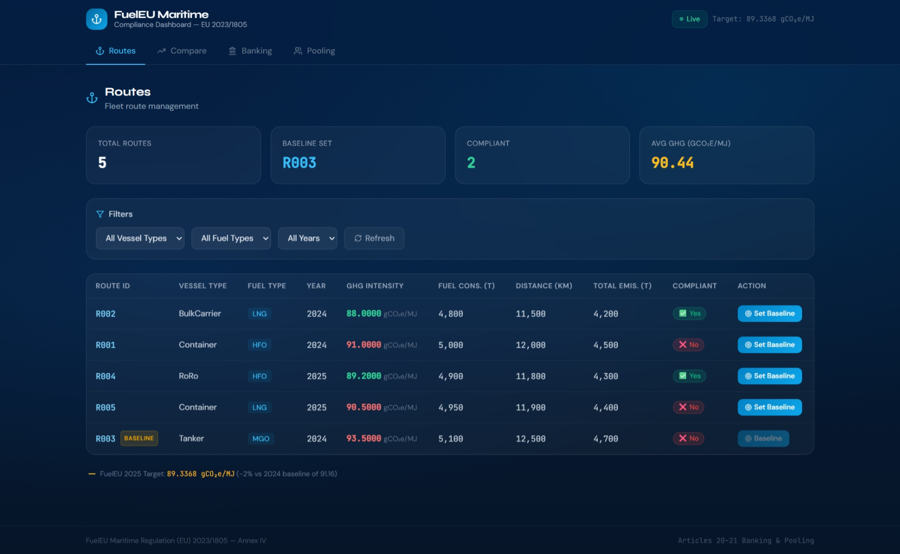
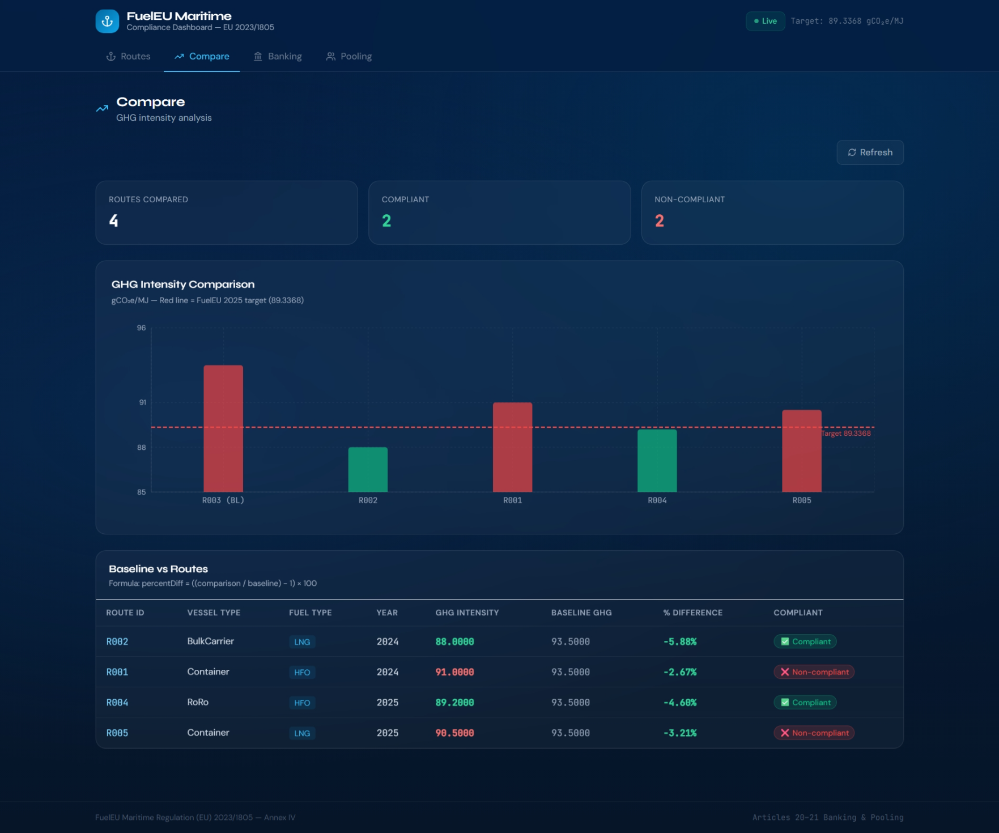
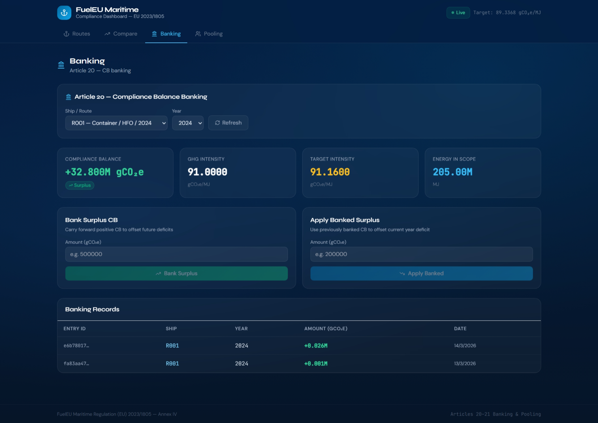
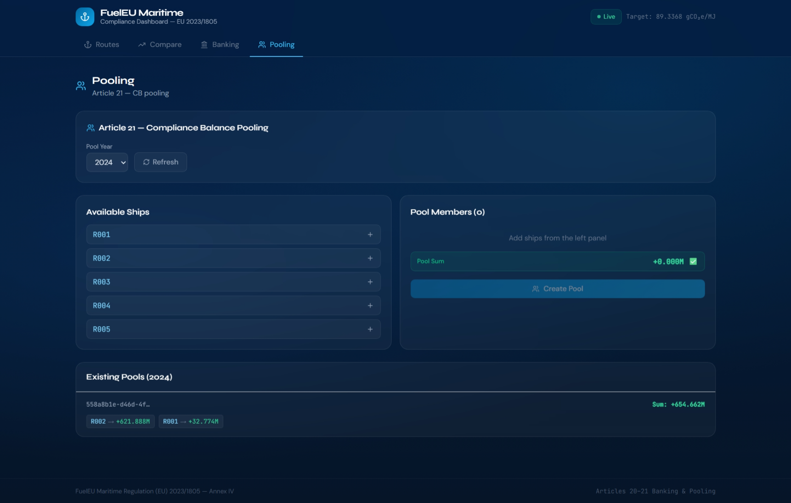
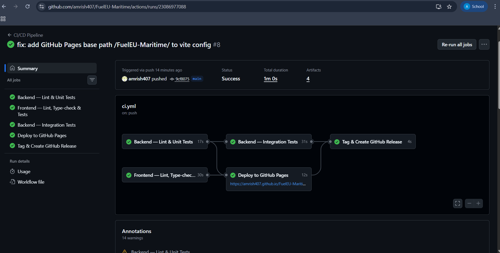
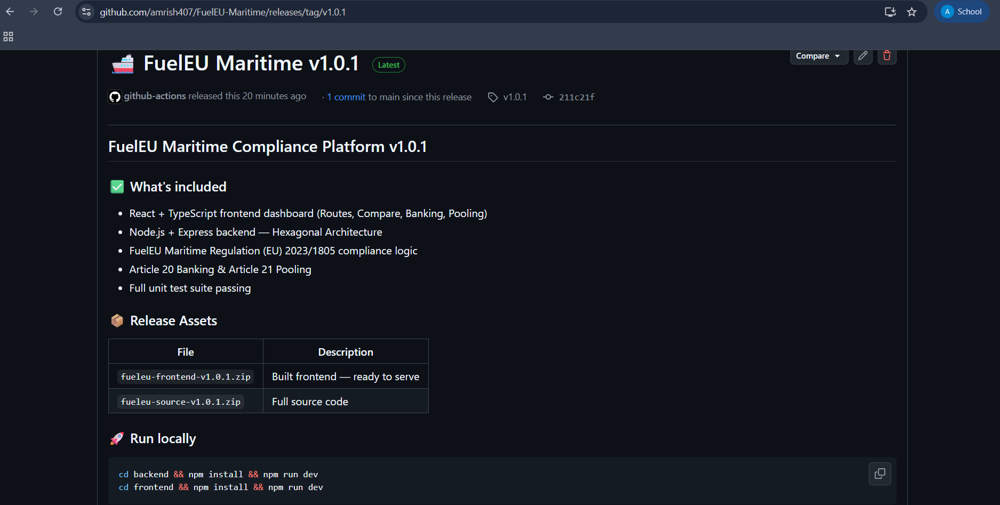

# FuelEU Maritime Compliance Platform

> Full-stack compliance dashboard implementing **FuelEU Maritime Regulation (EU) 2023/1805** — Articles 20–21 (Banking & Pooling), Annex IV.

## 🔗 Links

| Resource | URL |
|----------|-----|
| **GitHub Repository** | `https://github.com/amrish407/FuelEU-Maritime` |
| **Live Dashboard (GitHub Pages)** | `https://amrish407.github.io/FuelEU-Maritime/` |
| **CI/CD Pipeline** | `https://github.com/amrish407/FuelEU-Maritime/actions/workflows/ci.yml` |

---

## 📸 Screenshots

### Dashboard — Routes Tab

> _Screenshot: Routes tab showing all 5 vessels with GHG intensity, compliance status and Set Baseline action_

### Dashboard — Compare Tab

> _Screenshot: Compare tab showing bar chart with GHG intensity vs FuelEU 2025 target (89.3368 gCO₂e/MJ)_

### Dashboard — Banking Tab

> _Screenshot: Banking tab showing Compliance Balance KPIs and bank/apply surplus actions_

### Dashboard — Pooling Tab

> _Screenshot: Pooling tab showing pool builder with member CB before/after allocation_

### CI/CD Pipeline

> _Screenshot: GitHub Actions showing all jobs passing — Backend Tests → Integration Tests → Frontend Tests → Deploy → Release_

### GitHub Release

> _Screenshot: GitHub Releases page showing tagged release with frontend and source zip artifacts_

---

## 🏗️ Architecture Overview

This project follows **Hexagonal Architecture** (Ports & Adapters / Clean Architecture) in both frontend and backend. The core domain is completely framework-free and independently testable.

```
┌─────────────────────────────────────────────────────┐
│                    CORE (Domain)                     │
│   Route, Compliance, Banking, Pooling entities       │
│   Use-Cases: RouteUseCases, BankingUseCases, etc.   │
│   Ports: IRouteRepository, IBankingRepository, etc. │
│              NO framework dependencies               │
└──────────────────────┬──────────────────────────────┘
                       │
         ┌─────────────┴─────────────┐
         ▼                           ▼
┌─────────────────┐       ┌──────────────────────┐
│ Inbound Adapters│       │ Outbound Adapters     │
│ Express Routers │       │ PostgreSQL Repos      │
│ React Components│       │ API Client (fetch)    │
│ Custom Hooks    │       │                       │
└─────────────────┘       └──────────────────────┘
         │                           │
         ▼                           ▼
┌─────────────────┐       ┌──────────────────────┐
│ Infrastructure  │       │ Infrastructure        │
│ Vite / React    │       │ Express Server        │
│ TailwindCSS     │       │ PostgreSQL 18         │
└─────────────────┘       └──────────────────────┘
```

### Backend folder structure
```
backend/src/
├── core/
│   ├── domain/           # Route, Compliance, Banking, Pooling + formulas
│   ├── application/      # Use-cases (business logic)
│   └── ports/            # Repository interfaces (contracts)
├── adapters/
│   ├── inbound/http/     # Express route handlers
│   └── outbound/postgres/ # PostgreSQL implementations
├── infrastructure/
│   ├── db/               # connection, migrate, seed
│   └── server/           # app.ts (DI wiring), index.ts
└── __tests__/
    └── unit/             # Pure domain + use-case tests
```

### Frontend folder structure
```
frontend/src/
├── core/domain/          # Shared types and constants (no React deps)
├── adapters/
│   ├── infrastructure/   # apiClient.ts (fetch wrapper)
│   └── ui/               # Custom hooks + React tab components
└── __tests__/            # Vitest component and domain tests
```

---

## 🧮 Core FuelEU Formulas (Annex IV)

```
Target Intensity (2025) = 89.3368 gCO₂e/MJ  (−2% vs 2024 baseline 91.16)
Energy in Scope (MJ)    = fuelConsumption(t) × 41,000 MJ/t
Compliance Balance (CB) = (Target − Actual) × Energy in Scope
  CB > 0 → Surplus  |  CB < 0 → Deficit

Comparison % Diff       = ((comparison / baseline) − 1) × 100
```

---

## 🛠️ Tech Stack

| Layer | Technology |
|-------|-----------|
| Frontend | React 18, TypeScript (strict), TailwindCSS, Recharts |
| Backend | Node.js 20, TypeScript (strict), Express 4 |
| Database | PostgreSQL 18 |
| Testing | Jest + Supertest (backend), Vitest + Testing Library (frontend) |
| CI/CD | GitHub Actions |
| Hosting | GitHub Pages (frontend) |

---

## 🚀 Setup & Run Instructions

### Prerequisites
- Node.js 20+ — https://nodejs.org
- PostgreSQL 18 — https://www.postgresql.org/download/windows/

### Step 1 — Create the database
```bash
psql -U postgres -c "CREATE DATABASE fueleu_db;"
```

### Step 2 — Backend setup
```bash
cd backend

# Install dependencies
npm install

# Run database migrations
npm run db:migrate

# Seed sample data (5 routes)
npm run db:seed

# Start development server
npm run dev
# → API running at http://localhost:3001
```

### Step 3 — Frontend setup (new terminal)
```bash
cd frontend

# Install dependencies
npm install

# Start Vite dev server
npm run dev
# → Dashboard at http://localhost:5173
```

---

## 🧪 Running Tests

### Backend tests
```bash
cd backend

# All tests
npm run test

# Unit tests only (no DB required)
npm run test:unit

# Integration tests (requires PostgreSQL)
npm run test:integration

# Coverage report
npm run test:coverage
```

### Frontend tests
```bash
cd frontend

# All tests
npm run test

# Coverage report
npm run test:coverage
```

### Expected results
```
Backend:  30 passed, 0 failed
Frontend: 13 passed, 0 failed
```

---

## 🔗 API Endpoints

### Routes
| Method | Endpoint | Description |
|--------|----------|-------------|
| GET | `/routes` | All routes (filters: vesselType, fuelType, year) |
| POST | `/routes/:routeId/baseline` | Set route as baseline |
| GET | `/routes/comparison` | Baseline vs all routes with % diff |

### Compliance
| Method | Endpoint | Description |
|--------|----------|-------------|
| GET | `/compliance/cb?shipId&year` | Compute and store CB snapshot |
| GET | `/compliance/adjusted-cb?shipId&year` | CB after bank applications |

### Banking (Article 20)
| Method | Endpoint | Description |
|--------|----------|-------------|
| GET | `/banking/records?shipId&year` | Banking history |
| POST | `/banking/bank` | Bank positive CB surplus |
| POST | `/banking/apply` | Apply banked surplus to deficit |

### Pooling (Article 21)
| Method | Endpoint | Description |
|--------|----------|-------------|
| GET | `/pools` | List pools (optional ?year) |
| POST | `/pools` | Create pool with greedy allocation |
| GET | `/pools/:poolId` | Get pool details |

---

## 📊 Seed Data

| Route ID | Vessel Type | Fuel Type | Year | GHG Intensity | Compliant |
|----------|-------------|-----------|------|---------------|-----------|
| R001 | Container | HFO | 2024 | 91.0 | ❌ |
| R002 | BulkCarrier | LNG | 2024 | 88.0 | ✅ |
| R003 | Tanker | MGO | 2024 | 93.5 | ❌ |
| R004 | RoRo | HFO | 2025 | 89.2 | ✅ |
| R005 | Container | LNG | 2025 | 90.5 | ❌ |

---

## ⚙️ CI/CD Pipeline

The GitHub Actions pipeline runs automatically on every push to `main`:

```
git push origin main
        ↓
┌─────────────────────────────────┐
│ 1. Backend Unit Tests           │
│    → TypeScript check           │
│    → ESLint                     │
│    → Jest unit tests            │
│    → Upload coverage artifact   │
└────────────────┬────────────────┘
                 ↓
┌─────────────────────────────────┐
│ 2. Backend Integration Tests    │
│    → Spin up PostgreSQL service │
│    → Run migrations + seed      │
│    → Jest integration tests     │
└────────────────┬────────────────┘
                 ↓
┌─────────────────────────────────┐
│ 3. Frontend Tests + Build       │
│    → TypeScript check           │
│    → ESLint                     │
│    → Vitest + coverage          │
│    → Vite production build      │
│    → Upload build artifact      │
└────────────────┬────────────────┘
                 ↓
      ┌──────────┴──────────┐
      ▼                     ▼
┌──────────────┐   ┌────────────────────┐
│ 4. Deploy to │   │ 5. Tag & Release   │
│ GitHub Pages │   │ → Create git tag   │
│              │   │ → Upload 2 zips:   │
│ Live at:     │   │   frontend build   │
│ github.io/.. │   │   full source      │
└──────────────┘   └────────────────────┘
```

---

## 📦 Submission Checklist

- ✅ Public GitHub repository
- ✅ `/frontend` folder — React + TypeScript + TailwindCSS
- ✅ `/backend` folder — Node.js + TypeScript + PostgreSQL
- ✅ Hexagonal Architecture (Ports & Adapters)
- ✅ `npm run dev` works
- ✅ `npm run test` passes
- ✅ `AGENT_WORKFLOW.md` — AI agent documentation
- ✅ `REFLECTION.md` — reflection essay
- ✅ `README.md` — this file
- ✅ Incremental Git commit history
- ✅ GitHub Actions CI/CD pipeline
- ✅ GitHub Pages deployment
- ✅ Tagged releases with artifacts

---

## 📘 Reference

- **Fuel EU Maritime Regulation (EU) 2023/1805** — Annex IV, Articles 20–21
- ESSF SAPS WS1 FuelEU calculation methodologies (May 2025)